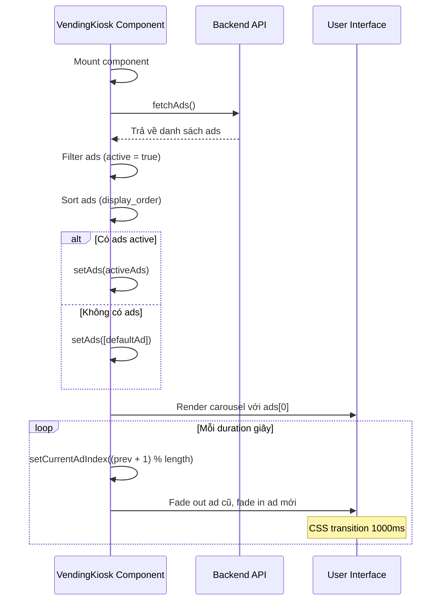

# Giải Thích Cách Hiển Thị Ads Ở Frontend

## Tổng Quan
Phần hiển thị quảng cáo (ads) ở frontend được triển khai trong component `VendingKiosk.jsx`. Ads được hiển thị dưới dạng **carousel tự động chuyển** ở phía trên cùng của màn hình vending machine, chiếm **35% chiều cao màn hình**.

---

## Cấu Trúc Hiển Thị

### Layout Component (3 Phần Chính)

```
┌────────────────────────────────────────┐
│  1. ADS CAROUSEL (35vh)                │ ← Phần hiển thị quảng cáo
│     - Full width                       │
│     - Auto-rotate carousel             │
│     - Video/Image support              │
├────────────────────────────────────────┤
│  2. INFO BAR (Sticky)                  │ ← Thông tin máy, logo, thời gian
│     - Logo, machine ID                 │
│     - Phone, WiFi status, Clock        │
├────────────────────────────────────────┤
│  3. PRODUCT GRID (Flex-1, Scrollable)  │ ← Danh sách sản phẩm
│     - 6 columns grid                   │
│     - Scrollable content               │
└────────────────────────────────────────┘
```

---

## Chi Tiết Implementation

### 1. State Management (Lines 70-72)

```javascript
// Carousel State
const [currentAdIndex, setCurrentAdIndex] = useState(0);
const [ads, setAds] = useState([]);
```

**Các state:**
- `currentAdIndex`: Index của quảng cáo đang hiển thị (0-based)
- `ads`: Mảng chứa danh sách quảng cáo đã fetch từ backend

---

### 2. Fetch Ads từ Backend (Lines 122-146)

```javascript
async function fetchAds() {
    try {
        const res = await fetch(`${API_BASE_URL}/ads`);
        const data = await res.json();
        if (data.success) {
            const activeAds = data.data
                .filter(ad => ad.active)              // Chỉ lấy ads active
                .sort((a, b) => a.display_order - b.display_order);  // Sắp xếp theo thứ tự

            if (activeAds.length > 0) {
                setAds(activeAds);
            } else {
                // Fallback nếu không có ads
                setAds([{
                    id: 'default',
                    type: 'image',
                    media_url: "https://images.unsplash.com/photo-1554866585-cd94860890b7?q=80&w=1000&auto=format&fit=crop",
                    title: "Default Ad"
                }]);
            }
        }
    } catch (err) {
        console.error("Failed to fetch ads:", err);
    }
}
```

**Luồng xử lý:**
1. **Fetch từ API**: `GET /api/ads`
2. **Filter**: Chỉ lấy ads có `active = true`
3. **Sort**: Sắp xếp theo `display_order` (từ nhỏ đến lớn)
4. **Fallback**: Nếu không có ads active → hiển thị 1 quảng cáo mặc định từ Unsplash

**Gọi lúc nào:**
- Khi component mount lần đầu (trong `useEffect` line 75)

---

### 3. Auto-Rotate Carousel Logic (Lines 109-120)

```javascript
useEffect(() => {
    if (ads.length === 0) return;  // Không làm gì nếu chưa có ads

    const currentAd = ads[currentAdIndex];
    const duration = (currentAd?.duration || 5) * 1000;  // Convert giây → ms

    const interval = setInterval(() => {
        setCurrentAdIndex((prev) => (prev + 1) % ads.length);  // Chuyển sang ad tiếp theo
    }, duration);

    return () => clearInterval(interval);  // Cleanup khi unmount hoặc dependency thay đổi
}, [ads, currentAdIndex]);
```

**Cơ chế hoạt động:**

1. **Kiểm tra ads**: Nếu `ads.length === 0` → return sớm
2. **Lấy duration**: Đọc thời lượng hiển thị từ `currentAd.duration` (đơn vị: giây)
   - Default: 5 giây nếu không có
3. **Set interval**: Tự động chuyển sau mỗi `duration` mili giây
4. **Circular rotation**: 
   - Công thức: `(prev + 1) % ads.length`
   - Khi đến ad cuối cùng → quay lại ad đầu tiên
5. **Cleanup**: Clear interval khi component unmount hoặc khi `ads`/`currentAdIndex` thay đổi

**Ví dụ:**
- Có 3 ads: [Ad0, Ad1, Ad2]
- Ad0 duration = 5s → hiển thị 5s
- Chuyển sang Ad1 duration = 10s → hiển thị 10s
- Chuyển sang Ad2 duration = 3s → hiển thị 3s
- Quay lại Ad0 → lặp lại vô hạn

---

### 4. UI Carousel Rendering (Lines 264-298)

```javascript
{/* 1. TOP ADS CAROUSEL (35vh) */}
<div className="relative h-[35vh] w-full overflow-hidden bg-black">
    {ads.map((ad, index) => (
        <div
            key={ad.id || index}
            className={`absolute inset-0 transition-opacity duration-1000 ease-in-out ${
                index === currentAdIndex ? "opacity-100" : "opacity-0"
            }`}
        >
            {ad.type === 'video' ? (
                <video
                    src={ad.media_url}
                    className="w-full h-full object-cover opacity-80"
                    autoPlay
                    muted
                    loop
                    playsInline
                />
            ) : (
                
            )}
            <div className="absolute inset-0 bg-gradient-to-t from-slate-950 via-transparent to-transparent" />
        </div>
    ))}

    <div className="absolute bottom-8 left-8 z-10">
        <h2 className="text-4xl font-black uppercase tracking-tighter text-transparent bg-clip-text bg-gradient-to-r from-cyan-400 to-blue-600 drop-shadow-[0_2px_10px_rgba(6,182,212,0.5)]">
            Giải khát cực đã
        </h2>
        <p className="text-slate-300 text-lg font-medium mt-1">Năng lượng bứt phá ngày dài</p>
    </div>
</div>
```

#### Cấu Trúc HTML:

```
<div class="relative h-[35vh]">              ← Container chính (35% viewport height)
  
  <div class="absolute inset-0 opacity-100"> ← Ad 1 (hiển thị)
     hoặc <video/>
    <div class="gradient-overlay"/>          ← Gradient phủ bóng
  </div>
  
  <div class="absolute inset-0 opacity-0">   ← Ad 2 (ẩn)
     hoặc <video/>
    <div class="gradient-overlay"/>
  </div>
  
  <div class="absolute bottom-8">            ← Text overlay cố định
    <h2>Giải khát cực đã</h2>
    <p>Năng lượng bứt phá ngày dài</p>
  </div>
  
</div>
```

---

### 5. Cơ Chế Fade Transition

#### CSS Classes Quan Trọng:

```css
/* Container */
relative         /* Positioning context cho absolute children */
h-[35vh]         /* Chiều cao 35% viewport */
overflow-hidden  /* Ẩn phần tràn ra ngoài */
bg-black         /* Nền đen */

/* Mỗi Ad Slide */
absolute inset-0                    /* Phủ toàn bộ container */
transition-opacity duration-1000    /* Fade transition 1 giây */
ease-in-out                         /* Easing function mượt */

/* Điều khiển hiển thị */
opacity-100  /* Ad đang hiển thị */
opacity-0    /* Ad bị ẩn */
```

#### Hoạt Động:

1. **Tất cả ads được render cùng lúc** (không conditionally render)
2. **Chồng lên nhau** với `absolute inset-0`
3. **Chỉ ad hiện tại** có `opacity-100`, các ad khác `opacity-0`
4. **CSS transition** tạo hiệu ứng fade mượt mà (1000ms)

**Ví dụ timeline:**
```
t = 0s:    Ad0 (opacity: 100%) → Ad1 (opacity: 0%)
t = 5s:    Trigger chuyển ad
t = 5-6s:  Ad0 fade out (100% → 0%), Ad1 fade in (0% → 100%)
t = 6s:    Ad0 (opacity: 0%) → Ad1 (opacity: 100%)
```

---

### 6. Xử Lý Video vs Image

```javascript
{ad.type === 'video' ? (
    <video
        src={ad.media_url}
        className="w-full h-full object-cover opacity-80"
        autoPlay    // Tự động phát khi load
        muted       // Tắt tiếng (yêu cầu của autoPlay)
        loop        // Phát lặp lại
        playsInline // Không fullscreen trên mobile
    />
) : (
    
)}
```

**Attributes quan trọng:**

| Attribute | Ý nghĩa | Lý do |
|-----------|---------|-------|
| `autoPlay` | Tự động phát video | Không cần user interaction |
| `muted` | Tắt tiếng | Browser chỉ cho autoPlay nếu muted |
| `loop` | Lặp lại video | Video tiếp tục phát trong duration |
| `playsInline` | Không fullscreen | Giữ video trong layout, không chiếm toàn màn hình |
| `object-cover` | Fill container | Giữ tỷ lệ, cắt phần thừa |
| `opacity-80` | Độ trong suốt 80% | Tạo hiệu ứng mờ nhẹ, không quá chói |

---

### 7. Gradient Overlay (Line 288)

```javascript
<div className="absolute inset-0 bg-gradient-to-t from-slate-950 via-transparent to-transparent" />
```

**Chức năng:**
- Tạo **gradient từ dưới lên trên**
- **Dưới cùng**: đen đậm (`slate-950`)
- **Giữa & trên**: trong suốt
- **Mục đích**: 
  - Tạo hiệu ứng chuyển màu mượt mà
  - Giúp text phía dưới dễ đọc hơn
  - Tạo độ sâu cho UI

---

### 8. Text Overlay Cố Định (Lines 292-297)

```javascript
<div className="absolute bottom-8 left-8 z-10">
    <h2 className="text-4xl font-black uppercase tracking-tighter text-transparent bg-clip-text bg-gradient-to-r from-cyan-400 to-blue-600 drop-shadow-[0_2px_10px_rgba(6,182,212,0.5)]">
        Giải khát cực đã
    </h2>
    <p className="text-slate-300 text-lg font-medium mt-1">
        Năng lượng bứt phá ngày dài
    </p>
</div>
```

**Đặc điểm UI:**
- **Vị trí cố định**: `bottom-8 left-8` (không thay đổi theo ad)
- **Luôn hiển thị**: `z-10` nằm trên tất cả ads
- **Text gradient**: 
  - `text-transparent`: Làm chữ trong suốt
  - `bg-clip-text`: Clip gradient vào text
  - `bg-gradient-to-r from-cyan-400 to-blue-600`: Gradient ngang từ cyan sang xanh
- **Drop shadow**: Bóng phát sáng xanh dương (`rgba(6,182,212,0.5)`)

---

## Sơ Đồ Luồng Hoạt Động



---

## Timeline Ví Dụ Cụ Thể

Giả sử có 3 ads:
- **Ad A**: duration = 5s, type = image
- **Ad B**: duration = 8s, type = video
- **Ad C**: duration = 3s, type = image

```
┌─────────────────────────────────────────────────────────────┐
│ Time  │ CurrentIndex │ Hiển thị │ Duration │ Transition     │
├───────┼──────────────┼──────────┼──────────┼────────────────┤
│ 0s    │ 0            │ Ad A     │ 5s       │ -              │
│ 5s    │ 1            │ Ad B     │ 8s       │ A fade → B     │
│ 13s   │ 2            │ Ad C     │ 3s       │ B fade → C     │
│ 16s   │ 0            │ Ad A     │ 5s       │ C fade → A     │
│ 21s   │ 1            │ Ad B     │ 8s       │ A fade → B     │
│ ...   │ ...          │ ...      │ ...      │ ...            │
└─────────────────────────────────────────────────────────────┘
```

---

## Đặc Điểm Kỹ Thuật

### ✅ Ưu Điểm

1. **Smooth transition**: Fade effect 1 giây rất mượt mà
2. **Flexible duration**: Mỗi ad có thể có thời lượng khác nhau
3. **Auto-play video**: Video tự động phát, loop, không cần interaction
4. **Responsive**: Chiều cao theo viewport (35vh)
5. **Fallback handling**: Có ad mặc định nếu không load được
6. **Performance**: Chỉ render 1 lần, toggle opacity thay vì re-render

### ⚠️ Hạn Chế

1. **Tất cả ads load cùng lúc**: 
   - Nếu có nhiều video lớn → tốn băng thông
   - Không lazy load
2. **Video autoplay issues**: 
   - Một số browser chặn autoplay
   - Cần muted để autoplay hoạt động
3. **Memory leak risk**: 
   - Không cleanup `URL.createObjectURL` nếu dùng
   - Video vẫn decode ngay cả khi opacity = 0
4. **Không có loading state**: Không hiển thị skeleton khi đang fetch
5. **Hard-coded text overlay**: 
   - "Giải khát cực đã" cố định
   - Không dynamic theo ad content

---

## Cải Tiến Đề Xuất

### 1. Lazy Load Videos

```javascript
{ad.type === 'video' ? (
    <video
        src={index === currentAdIndex ? ad.media_url : ''}  // Chỉ load video đang hiển thị
        className="w-full h-full object-cover opacity-80"
        autoPlay={index === currentAdIndex}
        muted
        loop
        playsInline
    />
) : (
    
)}
```

### 2. Preload Next Ad

```javascript
useEffect(() => {
    if (ads.length === 0) return;
    
    const nextIndex = (currentAdIndex + 1) % ads.length;
    const nextAd = ads[nextIndex];
    
    if (nextAd.type === 'image') {
        const img = new Image();
        img.src = nextAd.media_url;  // Preload ad tiếp theo
    }
}, [currentAdIndex, ads]);
```

### 3. Loading State

```javascript
const [adsLoading, setAdsLoading] = useState(true);

async function fetchAds() {
    setAdsLoading(true);
    try {
        // ... fetch logic
    } finally {
        setAdsLoading(false);
    }
}

// In UI
{adsLoading ? (
    <div className="h-[35vh] bg-slate-900 animate-pulse" />
) : (
    // Carousel
)}
```

### 4. Dynamic Text từ Ad

```javascript
<div className="absolute bottom-8 left-8 z-10">
    <h2 className="...">
        {ads[currentAdIndex]?.title || "Giải khát cực đã"}
    </h2>
    <p className="...">
        {ads[currentAdIndex]?.description || "Năng lượng bứt phá ngày dài"}
    </p>
</div>
```

### 5. Progress Bar

```javascript
const [progress, setProgress] = useState(0);

useEffect(() => {
    if (ads.length === 0) return;
    
    const duration = (ads[currentAdIndex]?.duration || 5) * 1000;
    const interval = setInterval(() => {
        setProgress((prev) => Math.min(prev + 100 / (duration / 100), 100));
    }, 100);
    
    return () => clearInterval(interval);
}, [currentAdIndex]);

// In UI
<div className="absolute bottom-0 left-0 h-1 bg-cyan-500" 
     style={{ width: `${progress}%` }} />
```

---

## Performance Considerations

### Video Performance
- **Codec**: Nên dùng H.264/MP4 để tương thích tốt với browser
- **Resolution**: Không nên quá 1080p, tối ưu là 720p
- **File size**: Nên < 10MB mỗi video
- **Duration**: Video ads nên 5-15 giây

### Image Performance
- **Format**: WebP hoặc JPEG tối ưu
- **Size**: Resize về đúng kích thước hiển thị (~1920x600px)
- **Compression**: Nén 70-80% quality
- **CDN**: Nên dùng CDN để tăng tốc độ load

---

## Kết Luận

Phần hiển thị ads trong frontend được thiết kế đơn giản nhưng hiệu quả:
- **Carousel tự động** với fade transition mượt mà
- **Hỗ trợ cả image & video** với autoplay
- **Dynamic duration** cho từng ad
- **Fallback mechanism** khi không có ads
- **Beautiful UI** với gradient overlays và text effects

Luồng hoạt động:
1. **Fetch ads** từ backend khi mount
2. **Filter & Sort** ads active
3. **Auto-rotate** theo duration của từng ad
4. **Smooth fade** transition giữa các ads
5. **Loop vô hạn** cho đến khi component unmount

Có thể cải thiện thêm về lazy loading, preloading, và loading states để tối ưu performance hơn nữa.
