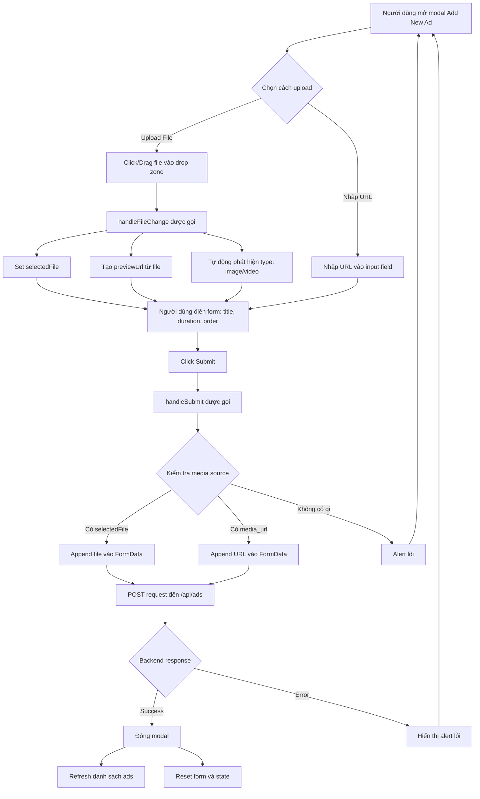

# Giải Thích Chức Năng Upload Ads trong AdsManager

## Tổng Quan
Component `AdsManager` quản lý việc tạo, hiển thị, và xóa quảng cáo (ads) trong hệ thống vending machine. Phần upload ads cho phép người dùng tải lên hình ảnh hoặc video quảng cáo theo 2 cách: **upload file trực tiếp** hoặc **sử dụng URL từ nguồn bên ngoài**.

---

## Luồng Hoạt Động Upload Ads

### 1. Khởi Tạo State (Lines 4-17)

```javascript
const [selectedFile, setSelectedFile] = useState(null);
const [previewUrl, setPreviewUrl] = useState('');
const [formData, setFormData] = useState({
    title: '',
    media_url: '',
    type: 'image',
    duration: 5,
    active: true,
    display_order: 0
});
```

**Các state quan trọng:**
- `selectedFile`: Lưu trữ file mà người dùng chọn để upload
- `previewUrl`: URL xem trước file đã chọn (tạo bằng `URL.createObjectURL()`)
- `formData`: Chứa tất cả thông tin của quảng cáo (tiêu đề, loại, thời lượng, thứ tự hiển thị, trạng thái active)

---

### 2. Xử Lý Chọn File (Lines 69-76)

```javascript
const handleFileChange = (e) => {
    const file = e.target.files[0];
    if (file) {
        setSelectedFile(file);
        setPreviewUrl(URL.createObjectURL(file));
        setFormData({ 
            ...formData, 
            type: file.type.startsWith('video/') ? 'video' : 'image' 
        });
    }
};
```

**Chức năng:**
1. Lấy file đầu tiên từ input (`e.target.files[0]`)
2. Lưu file vào state `selectedFile`
3. Tạo URL xem trước bằng `URL.createObjectURL(file)` để hiển thị preview
4. Tự động phát hiện loại file:
   - Nếu file bắt đầu với `video/` → set type = `'video'`
   - Ngược lại → set type = `'image'`

---

### 3. Giao Diện Upload (Lines 192-226)

#### Input File (Lines 196-201)
```javascript
<input
    type="file"
    accept="image/*,video/*"
    onChange={handleFileChange}
    className="absolute inset-0 w-full h-full opacity-0 cursor-pointer"
/>
```

**Đặc điểm:**
- `accept="image/*,video/*"`: Chỉ cho phép chọn file ảnh hoặc video
- `opacity-0`: Ẩn input gốc, sử dụng CSS để tạo UI đẹp hơn
- `absolute inset-0`: Phủ toàn bộ vùng drop zone để có thể click bất kỳ đâu

#### Preview Preview (Lines 203-211)
```javascript
{previewUrl ? (
    <div className="relative">
        {formData.type === 'video' ? (
            <video src={previewUrl} className="mx-auto h-32 object-cover rounded" controls />
        ) : (
            
        )}
        <p className="text-xs text-gray-500 mt-2">Click to change file</p>
    </div>
) : (
    // Hiển thị UI upload ban đầu
)}
```

**Logic:**
- Nếu đã có `previewUrl` → Hiển thị preview của file (video hoặc image)
- Nếu chưa có → Hiển thị icon upload và hướng dẫn

#### UI Upload Ban Đầu (Lines 213-222)
```javascript
<>
    <Upload className="mx-auto h-12 w-12 text-gray-400" />
    <div className="flex text-sm text-gray-600">
        <span>Upload a file</span>
        <p className="pl-1">or drag and drop</p>
    </div>
    <p className="text-xs text-gray-500">PNG, JPG, MP4 up to 50MB</p>
</>
```

---

### 4. Phần Nhập URL Thay Thế (Lines 228-239)

```javascript
<div className="text-center text-sm text-gray-500">- OR -</div>

<div>
    <label className="block text-sm font-medium text-gray-700 mb-1">
        Media URL (External)
    </label>
    <input
        type="text"
        value={formData.media_url}
        onChange={(e) => setFormData({ ...formData, media_url: e.target.value })}
        placeholder="https://example.com/image.jpg"
        className="w-full px-3 py-2 border border-gray-300 rounded-lg"
    />
</div>
```

**Chức năng:**
- Cho phép người dùng nhập URL của media từ nguồn bên ngoài
- Thay vì upload file, có thể sử dụng link từ CDN hoặc server khác

---

### 5. Submit Form (Lines 78-115)

```javascript
const handleSubmit = async (e) => {
    e.preventDefault();
    try {
        const data = new FormData();
        data.append('title', formData.title);
        data.append('type', formData.type);
        data.append('duration', formData.duration);
        data.append('active', formData.active);
        data.append('display_order', formData.display_order);

        // Ưu tiên file upload, nếu không có thì dùng URL
        if (selectedFile) {
            data.append('file', selectedFile);
        } else if (formData.media_url) {
            data.append('media_url', formData.media_url);
        } else {
            alert('Please provide a Media URL or upload a file');
            return;
        }

        const res = await fetch('http://localhost:3000/api/ads', {
            method: 'POST',
            body: data // FormData tự động set Content-Type
        });

        const result = await res.json();
        if (result.success) {
            setIsModalOpen(false);
            fetchAds();
            // Reset form
            setFormData({ title: '', media_url: '', type: 'image', duration: 5, active: true, display_order: 0 });
            setSelectedFile(null);
            setPreviewUrl('');
        } else {
            alert(result.message);
        }
    } catch (error) {
        console.error('Error creating ad:', error);
    }
};
```

#### Luồng Xử Lý:

1. **Tạo FormData object** (Lines 81-86)
   - Thêm các thông tin cơ bản: title, type, duration, active, display_order

2. **Kiểm tra nguồn media** (Lines 88-95)
   - **Ưu tiên 1:** Nếu có `selectedFile` → append file vào FormData
   - **Ưu tiên 2:** Nếu không có file nhưng có `media_url` → append URL
   - **Lỗi:** Nếu không có cả 2 → hiển thị alert yêu cầu cung cấp media

3. **Gửi request đến backend** (Lines 97-100)
   - Method: `POST`
   - URL: `http://localhost:3000/api/ads`
   - Body: FormData (không cần set header Content-Type, browser tự động thêm)

4. **Xử lý response** (Lines 102-111)
   - Nếu thành công: đóng modal, refresh danh sách ads, reset form
   - Nếu thất bại: hiển thị thông báo lỗi

5. **Reset state** (Lines 106-108)
   - Clear tất cả input
   - Remove preview URL
   - Reset selectedFile về null

---

## Diagram Luồng Upload



---

## Ưu và Nhược Điểm

### ✅ Ưu Điểm

1. **Linh hoạt:** Hỗ trợ 2 cách upload (file hoặc URL)
2. **User-friendly:** 
   - Có preview trước khi submit
   - Auto-detect loại file (image/video)
   - Drag & Drop support
3. **Validation:** Kiểm tra media source trước khi submit
4. **Clean code:** State management rõ ràng, dễ maintain

### ⚠️ Nhược Điểm

1. **Không có progress bar:** Không hiển thị tiến trình upload cho file lớn
2. **Không giới hạn file size:** UI ghi "up to 50MB" nhưng code không validate
3. **Error handling đơn giản:** Chỉ dùng `alert()` thay vì UI toast/notification
4. **Không có image compression:** File upload nguyên bản, không optimize
5. **Preview URL leak:** Không cleanup `URL.createObjectURL()` khi component unmount

---

## Cải Tiến Đề Xuất

### 1. Thêm Upload Progress
```javascript
const [uploadProgress, setUploadProgress] = useState(0);

const handleSubmit = async (e) => {
    // ...
    const xhr = new XMLHttpRequest();
    xhr.upload.addEventListener('progress', (e) => {
        if (e.lengthComputable) {
            setUploadProgress((e.loaded / e.total) * 100);
        }
    });
    // ...
};
```

### 2. Validate File Size
```javascript
const handleFileChange = (e) => {
    const file = e.target.files[0];
    const maxSize = 50 * 1024 * 1024; // 50MB
    
    if (file && file.size > maxSize) {
        alert('File quá lớn! Vui lòng chọn file nhỏ hơn 50MB');
        return;
    }
    // ...
};
```

### 3. Cleanup Preview URL
```javascript
useEffect(() => {
    return () => {
        if (previewUrl) {
            URL.revokeObjectURL(previewUrl);
        }
    };
}, [previewUrl]);
```

### 4. Image Compression (sử dụng library như `browser-image-compression`)
```javascript
import imageCompression from 'browser-image-compression';

const handleFileChange = async (e) => {
    const file = e.target.files[0];
    if (file && file.type.startsWith('image/')) {
        try {
            const compressedFile = await imageCompression(file, {
                maxSizeMB: 1,
                maxWidthOrHeight: 1920
            });
            setSelectedFile(compressedFile);
        } catch (error) {
            console.error('Compression error:', error);
        }
    }
};
```

---

## Kết Luận

Phần upload ads trong `AdsManager` được thiết kế khá tốt với giao diện trực quan và hỗ trợ nhiều cách upload. Tuy nhiên, vẫn có thể cải thiện về mặt validation, error handling, và user experience (progress bar, compression, etc.).

Luồng hoạt động chính:
1. **Select File/URL** → 
2. **Preview** → 
3. **Fill Form** → 
4. **Submit** → 
5. **Backend Processing** → 
6. **Update UI**
